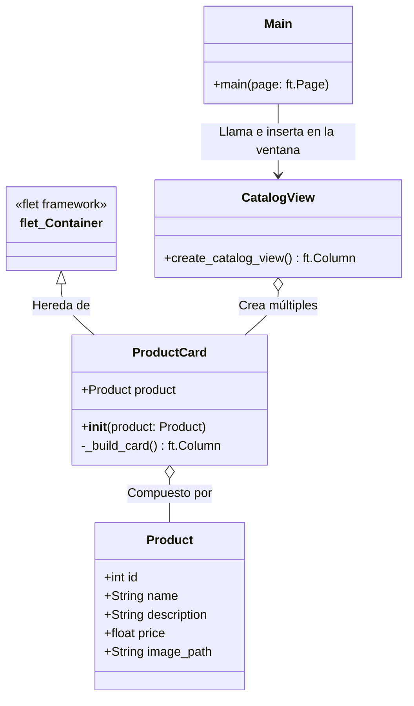
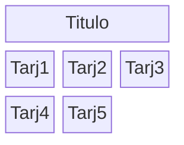

# Documentación del Proyecto Integrador - Catálogo de Productos Reutilizable

Este documento sirve como reporte para acreditar la Unidad 2, detallando la arquitectura y diseño del catálogo de productos construido con Flet en Python.

## 1. Diagrama de Clases

La aplicación fue diseñada siguiendo principios de modularidad y responsabilidad única. A continuación, se muestra el diagrama de clases representando el modelo de datos, la interfaz de inicio y el componente reutilizable:



## 2. Explicación de la Herencia

Para el desarrollo del componente visual `Custom Card` (tarjeta de producto reutilizable), se utilizó el concepto de **Herencia**.

La clase personalizada `ProductCard` (ubicada en `components/product_card.py`) hereda directamente de la clase base `ft.Container` proporcionada por el framework Flet.

**¿Por qué elegir `ft.Container`?**
Heredar de `ft.Container` es ideal para la creación de controles reutilizables personalizados porque nos permite configurar directamente las propiedades de empaquetado y diseño principales de la tarjeta sin necesidad de envolver el contenido en más niveles. Gracias a esto pudimos establecer fácilmente en el constructor (`__init__`):
- `self.width`: Para tener un ancho fijo (uniformidad).
- `self.bgcolor` y `self.border_radius`: Para crear los bordes redondeados y darle un color de fondo.
- `self.padding`: Para asegurar que el texto y las imágenes tengan margen interno.
- `self.shadow`: Para implementar la sombra sutil requerida por las especificaciones.

Luego, el contenido interno se inyecta en la propiedad `self.content` utilizando un `ft.Column`.

## 3. Gestión de Recursos (Imágenes)

Para que el framework Flet pueda localizar y servir archivos locales (como imágenes .png, .jpg), es necesario configurar explícitamente el directorio de recursos (assets).

**Estructura del directorio:**
Las imágenes se almacenaron físicamente en una carpeta llamada `assets` en la raíz del proyecto.

**Configuración en código:**
En el punto de entrada de la aplicación (`main.py`), al momento de disparar la aplicación con la función run o app, se especificó la ruta a través del parámetro `assets_dir`:
```python
if __name__ == "__main__":
    ft.app(main, assets_dir="assets")
```
Esto levanta un servidor interno en Flet que mapea las rutas relativas en los componentes de imagen (`ft.Image(src="prod1.jpg")`) a la carpeta `assets` seleccionada.

## 4. Capturas de Pantalla

> Para comprobar la correcta ejecución, ejecuta el archivo `main.py`.

La siguiente imagen (simulada aquí con mermaid) representa visualmente la disposición final de los componentes en la Pantalla (GUI) utilizando un `ft.Row` con `wrap=True` que permite que las tarjetas fluyan a la siguiente línea al redimensionar la ventana:



La aplicación cumple con el estilo coherente, sombras sutiles, imágenes estáticas y botones de acción en todos los componentes dinámicos.

## Preparación para la Unidad 4

El código es altamente modular gracias a su división en carpetas:
* `/models/product.py`: Permite modificar la estructura de datos rápidamente.
* `/data/repository.py`: Actualmente devuelve una lista estática (arreglo simulado). Para la Unidad 4 (Acceso a Datos), solo necesitaremos transformar la función `get_products()` para que realice una petición HTTP (API externa) o se conecte mediante SQL a una base de datos.
* **Toda la interfaz (`catalog_view.py`) y componente (`product_card.py`) permanecerán intactos**, ya que están abstraídos de la fuente de datos esperando solo un arreglo de objetos `Product`.
