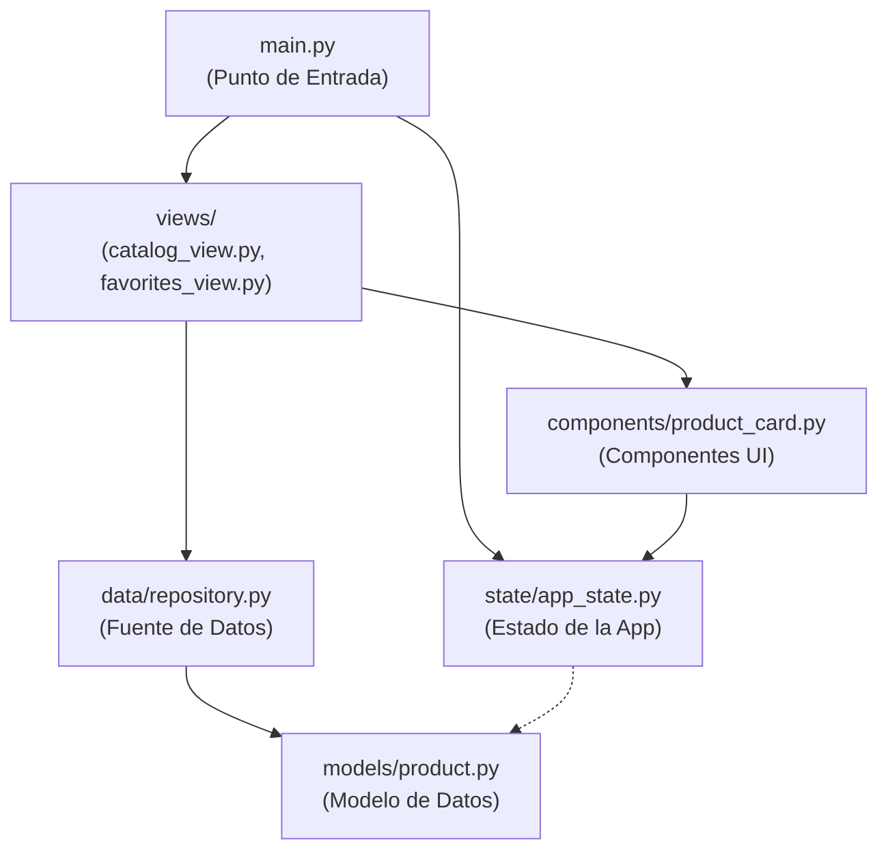
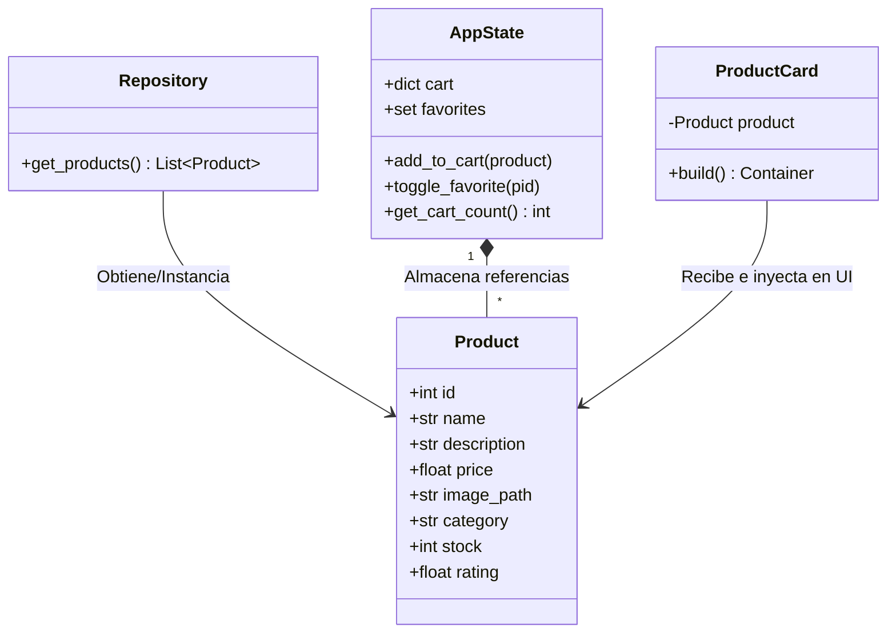

# Catálogo de Productos TechStore 🛒

Este proyecto es una aplicación interactiva desarrollada en Python utilizando el moderno framework **Flet**. La aplicación simula una tienda en línea (TechStore) donde los usuarios pueden visualizar productos, agregarlos a un carrito de compras y marcarlos como favoritos.

🌍 **Enlace al proyecto:** [https://productoscat.netlify.app/](https://productoscat.netlify.app/)

## 🚀 Características Principales

- **Catálogo Dinámico:** Visualización atractiva de los productos con imágenes, precios y detalles.
- **Carrito de Compras:** Sistema para agregar, incrementar, disminuir o eliminar productos del carrito, con cálculo automático del total.
- **Favoritos:** Posibilidad de marcar y desmarcar productos como favoritos.
- **Diseño Responsivo:** Adaptable tanto a dispositivos móviles como a pantallas de escritorio. Cuenta con un diseño elegante basado en un tema oscuro (Dark Theme).
- **Manejo de Estado (State Management):** Uso de clases para mantener centralizado el estado global de la aplicación.

---

## 🏗️ Arquitectura y Estructura del Código

El proyecto sigue una arquitectura modular y organizada, separando el código en distintas responsabilidades para hacerlo más mantenible:



### 1. Punto de Entrada (`main.py`)
Es el punto de entrada principal. Se encarga de inicializar la página, definir el tema visual (modo oscuro), y construir la interfaz con todos sus componentes. También gestiona la lógica de diálogos y pop-ups.
```python
import flet as ft
from state.app_state import AppState

def main(page: ft.Page):
    page.title = "TechStore — Premium Experience"
    page.bgcolor = "#0B0F19" # Fondo principal Dark Theme
    page.padding = 0
    page.theme_mode = ft.ThemeMode.DARK
    
    # Manejador de estado global de la app
    state = AppState()
    # ... Resto de la lógica UI con Flet
```

### 2. Modelo de Datos (`models/product.py`)
Define la estructura de datos para un artículo tecnológico utilizando `dataclasses` para una generación automática y limpia de constructores.
```python
from dataclasses import dataclass, field
from typing import List

@dataclass
class Product:
    """Modelo de datos para un artículo tecnológico."""
    id: int
    name: str
    description: str
    price: float
    image_path: str
    category: str = "General"
    stock: int = 10
    rating: float = 4.0
    images: List[str] = field(default_factory=list)
```

### 3. Estado de la Aplicación (`state/app_state.py`)
Controla la lógica de negocio y almacena la información que cambia dinámicamente durante el uso de la app. Gestiona centralmente el carrito de compras y los productos favoritos para que todo componente visual interactúe con el mismo origen de datos.
```python
class AppState:
    """Estado global compartido: carrito y favoritos."""
    def __init__(self):
        self.cart: dict[int, dict] = {}   # Guarda el artículo y la cantidad
        self.favorites: set[int] = set()  # IDs de productos favoritos

    def add_to_cart(self, product):
        pid = product.id
        if pid in self.cart:
            self.cart[pid]["qty"] += 1
        else:
            self.cart[pid] = {"product": product, "qty": 1}

    def toggle_favorite(self, pid: int):
        if pid in self.favorites:
            self.favorites.discard(pid)
        else:
            self.favorites.add(pid)
```

### 4. Vistas y Componentes Reutilizables (`views/` y `components/`)
El aspecto visual de Flet se encapsula en funciones reutilizables que construyen contenedores dinámicos, adaptándose a la información proporcionada.

#### Tarjeta de Producto (`components/product_card.py`)
Construye la tarjeta visual para cada ítem del catálogo, permitiendo interacciones (favorito, carrito y vista detalle).
```python
def build_product_card(product: Product, state, on_add_to_cart, on_toggle_fav, on_view_detail):
    is_fav = state.is_favorite(product.id)
    in_stock = product.stock > 0

    return ft.Container(
        # Comportamiento Responsivo 
        col={"xs": 12, "sm": 6, "md": 4, "lg": 3},
        bgcolor="#1A2235",
        border_radius=16,
        on_click=lambda e: on_view_detail(product),
        content=ft.Column(
            controls=[
                ft.Image(src=product.image_path, fit=ft.BoxFit.COVER),
                ft.Text(product.name, size=16, weight=ft.FontWeight.W_700),
                # Y los botones respectivos...
            ]
        )
    )
```

#### Panel Principal / Catálogo (`views/catalog_view.py`)
Genera la grilla de productos y gestiona su sistema de filtrado avanzado, como búsqueda y rango de precio.
```python
def build_catalog_panel(page, state, all_products, on_add_to_cart, on_toggle_fav, on_view_detail):
    # Diccionario de estado interno de búsqueda
    fs = {"search": "", "min": 0.0, "max": 99999.0, "sort": "name_asc", "cat": "Todas"}
    
    def get_filtered():
        # Lógica para filtrar y mapear cada producto
        products = list(all_products)
        if fs["cat"] != "Todas": 
            products = [p for p in products if p.category == fs["cat"]]
        # ...Más lógicas de filtro por precio y texto...
        return products

    # Retorna un agrupador o 'Grid' Responsivo
    return ft.Container(
        content=ft.Column([
            ft.ResponsiveRow(controls=[
               build_product_card(p, state, ...) for p in get_filtered()
            ])
        ])
    ), refresh_grid
```

#### Panel de Favoritos (`views/favorites_view.py`)
Es similar al catálogo, pero filtra únicamente aquellos que se encuentran en el conjunto `state.favorites`.
```python
def build_favorites_panel(page, state, all_products, on_add_to_cart, on_toggle_fav, on_view_detail):
    
    def refresh_favs():
        fav_ids  = state.get_favorites()
        products = [p for p in all_products if p.id in fav_ids]

        if not products:
            # Mensaje cuando está vacío
            grid_ref.current.controls = [ft.Text("Aún no tienes favoritos")]
        else:
            # Reutilizando el componente Card
            grid_ref.current.controls = [
                build_product_card(p, ...) for p in products
            ]
            
    # Retorna el componente y su disparador de recarga
    return ft.Container(...), refresh_favs
```

### 5. Controladores Especiales
- **`data/repository.py`**: Proporciona la base de datos simulada mediante una lista en memoria.
```python
def get_products() -> list[Product]:
    return [
        Product(
            id=1, name="Smartwatch Pro X",
            description="Reloj inteligente con monitor de ritmo...",
            price=199.99, image_path="smartwatch.png", category="Wearables",
        ),
        # ... más productos
    ]
```
- **`generate_qr.py`**: Un pequeño script en python que mediante `qrcode` genera una imagen QR dirigiendo automáticamente hacia [https://productoscat.netlify.app/](https://productoscat.netlify.app/).

---

## 📚 Librerías Utilizadas

El proyecto utiliza distintas librerías declaradas en el archivo `requirements.txt`:

1. **[Flet](https://flet.dev/)**: 
   Es la tecnología principal del proyecto. Flet es un framework que permite crear aplicaciones web, de escritorio y móviles interactivas en Python sin necesidad de escribir código en frontend (HTML, CSS o JavaScript). Utiliza Flutter bajo el capó para renderizar las interfaces.

2. **[qrcode](https://pypi.org/project/qrcode/)**:
   Una librería utilizada para la creación de códigos QR. En el proyecto se usa para generar un código que los usuarios puedan escanear con la cámara y acceder directamente a la aplicación (script `generate_qr.py`).

3. **[Pillow](https://python-pillow.org/)**:
   Es la biblioteca estándar de procesamiento de imágenes en Python (fork de PIL). Trabaja en conjunto con la librería `qrcode` para crear o manipular la imagen del archivo QR final.

## 🛠️ Cómo Ejecutar el Proyecto Localmente

Para correr la aplicación en tu computadora, sigue estos pasos:

1. Clona o descarga este repositorio.
2. Abre una terminal y navega hasta la carpeta del proyecto.
3. Se recomienda crear un entorno virtual e instalar las dependencias:
   ```bash
   pip install -r requirements.txt
   ```
4. Ejecuta el archivo principal:
   ```bash
   python main.py
   ```
   *Alternativamente, puedes usar `root_web.py` o `run_mobile.py` dependiendo del entorno que quieras probar.*

### 6. Funciones Centrales (`main.py`)
El archivo `main.py` contiene tanto las validaciones iniciales de las pantallas como funciones exclusivas para manejar la UI compleja y delegar estados. A continuación explico sus componentes clave:

#### `update_badge()`
Muestra visualmente sobre el icono de carrito la cantidad de artículos elegidos. Llama al `state.get_cart_count()` para pedir la cuenta y muestra el número en la UI.
```python
    def update_badge():
        count = state.get_cart_count()
        badge_ref.current.visible = count > 0
        badge_text_ref.current.value = str(count)
        page.update()
```

#### `_refresh_cart()` y `open_cart()`
Manejan la lógica de renderizar o actualizar el pop-up de diálogo con el carrito de compras del usuario. 
`_refresh_cart()` se encarga de crear internamente la fila de cada producto (botones sumar "+", restar "-" o eliminar un ítem total), y `open_cart()` abre el diálogo sobre el resto de la página.
```python
    def _refresh_cart():
        items = state.get_cart_items()
        if not items:
            cart_body.controls = [ ... ] # Muestra mensaje de "Tu carrito está vacío"
        else:
            rows = []
            for item in items: # Recorre todo lo almacenado en estado
                p, qty = item["product"], item["qty"]
                # Cierres lambda vinculados al ID del producto `p.id`
                def dec(pid=p.id): state.update_cart_qty(pid, -1); update_badge(); _refresh_cart(); page.update()
                def inc(pid=p.id): state.update_cart_qty(pid, 1); update_badge(); _refresh_cart(); page.update()
                def rem(pid=p.id): state.remove_from_cart(pid); update_badge(); _refresh_cart(); page.update()
```

#### `switch_tab()` y la Navegación (Tabs)
Para simular el cambio entre el "Catálogo" y "Favoritos", en lugar de recargar pantallas en el navegador, se cambia el `content` del contenedor principal usando Flet Reference `Ref()`.
```python
    content_area_ref = ft.Ref[ft.Container]()
    panels = [catalog_panel, favorites_panel] # Arreglo con la interfaz de las ventanas devueltas

    def switch_tab(idx: int):
        # Actualiza visualmente las variables en panel elegido
        if idx == 0:
            refresh_catalog()
        elif idx == 1:
            refresh_favs()
        
        # Intercambia el contenedor mostrado
        content_area_ref.current.content = panels[idx]
        
        # Modifica la barrita de estado remarcando la opción del menú superior
        for i, ref in enumerate(tab_indicator_refs):
            ref.current.border = ft.Border(bottom=ft.BorderSide(3, PRIMARY if i == idx else "transparent"))
        page.update()
```

#### `open_detail(product: Product)`
Cuando el usuario da clic en la imagen, se llama al modal. El pop-up de Flet (`ft.AlertDialog`) se configura inyectando un `Container` con la estructura del modelo, cambiando valores como el tamaño del texto dependiente de la función `get_is_mobile()`. Incluye sus propias sub-funciones lambda para agregar carrito o a favoritos desde este acercamiento.
```python
    def open_detail(product: Product):
        # Sub-funciones anclas a los botones visuales grandes
        def add(e):
            state.add_to_cart(product)
            update_badge()
            page.snack_bar = ft.SnackBar(
                content=ft.Text(f"¡{product.name} añadido al carrito!", color="#FFFFFF"), 
                bgcolor="#10B981"
            )
            page.snack_bar.open = True
            page.update()

        def fav(e):
            state.toggle_favorite(product.id)
            is_fav = state.is_favorite(product.id)
            e.control.icon = ft.Icons.FAVORITE if is_fav else ft.Icons.FAVORITE_OUTLINE_ROUNDED
            e.control.update()

        # Construcción visual
        main_dialog.content = ft.Container(
            content=ft.Column([
                ft.Image(src=product.image_path, fit=ft.BoxFit.COVER),
                ft.Text(product.name, size=28, weight=ft.FontWeight.W_800),
                ft.Text(f"${product.price:,.2f}", size=32, color=TEXT_MAIN),
                ft.Text(product.description, color=TEXT_SUB),
                # Botones que llaman a add() y fav() omitidos...
            ])
        )
        main_dialog.open = True
        page.update()
```

### 7. Lógica de Filtrado y Búsqueda (`catalog_view.py`)
El catálogo no solo muestra productos, sino que incluye un motor de búsqueda y filtros en tiempo real. Esta función re-evalúa la lista completa de productos basándose en diccionarios de configuración (`fs`) cada vez que el usuario escribe algo o cambia el rango de precio.
```python
    def get_filtered():
        # Copia la lista original de la base de datos simulada
        products = list(all_products)
        
        # 1. Filtro por categoría exacta
        if fs["cat"] != "Todas": 
            products = [p for p in products if p.category == fs["cat"]]
            
        # 2. Búsqueda por texto (Nombre o Descripción) manual
        if fs["search"]:
            q = fs["search"].lower()
            products = [p for p in products if q in p.name.lower() or q in p.description.lower()]
            
        # 3. Filtro numérico por rango de precios
        products = [p for p in products if fs["min"] <= p.price <= fs["max"]]
        
        # 4. Ordenamiento (Sort)
        if fs["sort"] == "price_asc": products.sort(key=lambda x: x.price)
        elif fs["sort"] == "price_desc": products.sort(key=lambda x: x.price, reverse=True)
        elif fs["sort"] == "name_asc": products.sort(key=lambda x: x.name)
        return products
```
Este método se invoca antes de construir el "Grid" `ft.ResponsiveRow` y es clave para dar una auténtica experiencia E-commerce dinámico.

### 8. Generador de Código QR (`generate_qr.py`)
Se incluyó un pequeño script externo a la lógica de **Flet** que utiliza la librería `qrcode` y `Pillow`. Su objetivo es crear un puente entre el mundo físico y la aplicación web para facilitar la distribución del proyecto.
```python
import qrcode
from PIL import Image

def create_project_qr():
    # URL de producción del proyecto alojado
    project_url = "https://productoscat.netlify.app/"
    
    # Genera la matriz QR a partir del un string
    qr_image = qrcode.make(project_url)
    
    # Guarda el resultado gráficamente dentro de la carpeta assets
    qr_image.save("assets/tienda_qr.png")
    print("¡El código QR se generó con éxito en assets/tienda_qr.png!")

if __name__ == "__main__":
    create_project_qr()
```

---
¡Gracias por visitar el proyecto! Explora el código y prueba la tienda funcional en el [enlace oficial](https://productoscat.netlify.app/).

---

## 🎓 Documentación del Proyecto Integrador - Catálogo de Productos Reutilizable
Este documento sirve como reporte para acreditar la Unidad 2, detallando la arquitectura y diseño del catálogo de productos construido con Flet en Python.

### 1. Diagrama de Clases
La aplicación fue diseñada siguiendo principios de modularidad y responsabilidad única. A continuación, se muestra el diagrama de clases representando el modelo de datos, la interfaz de inicio y el componente reutilizable:



### 2. Explicación de la Herencia
Para el desarrollo del componente visual Custom Card (tarjeta de producto reutilizable), se utilizó el concepto de Herencia.

La clase personalizada `ProductCard` (ubicada en `components/product_card.py`) hereda directamente de la clase base `ft.Container` proporcionada por el framework Flet.

**¿Por qué elegir `ft.Container`?**
Heredar de `ft.Container` es ideal para la creación de controles reutilizables personalizados porque nos permite configurar directamente las propiedades de empaquetado y diseño principales de la tarjeta sin necesidad de envolver el contenido en más niveles. Gracias a esto pudimos establecer fácilmente en el constructor (`__init__`):

- `self.width`: Para tener un ancho fijo (uniformidad).
- `self.bgcolor` y `self.border_radius`: Para crear los bordes redondeados y darle un color de fondo.
- `self.padding`: Para asegurar que el texto y las imágenes tengan margen interno.
- `self.shadow`: Para implementar la sombra sutil requerida por las especificaciones.

Luego, el contenido interno se inyecta en la propiedad `self.content` utilizando un `ft.Column`.

### 3. Gestión de Recursos (Imágenes)
Para que el framework Flet pueda localizar y servir archivos locales (como imágenes `.png`, `.jpg`), es necesario configurar explícitamente el directorio de recursos (assets).

- **Estructura del directorio:** Las imágenes se almacenaron físicamente en una carpeta llamada `assets` en la raíz del proyecto.
- **Configuración en código:** En el punto de entrada de la aplicación (`main.py`), al momento de disparar la aplicación con la función `run` o `app`, se especificó la ruta a través del parámetro `assets_dir`:

```python
if __name__ == "__main__":
    ft.app(main, assets_dir="assets")
```
Esto levanta un servidor interno en Flet que mapea las rutas relativas en los componentes de imagen (`ft.Image(src="prod1.jpg")`) a la carpeta `assets` seleccionada.

### 4. Capturas de Pantalla
Para comprobar la correcta ejecución, ejecuta el archivo `main.py`.

La siguiente imagen representa visualmente la disposición final de los componentes en la Pantalla (GUI) utilizando un `ft.Row` con `wrap=True` que permite que las tarjetas fluyan a la siguiente línea al redimensionar la ventana:
*(Nota: Aquí deberás agregar tus capturas de pantalla)*

La aplicación cumple con el estilo coherente, sombras sutiles, imágenes estáticas y botones de acción en todos los componentes dinámicos.

### 5. Preparación para la Unidad 4
El código es altamente modular gracias a su división en carpetas:

- `/models/product.py`: Permite modificar la estructura de datos rápidamente.
- `/data/repository.py`: Actualmente devuelve una lista estática (arreglo simulado). Para la Unidad 4 (Acceso a Datos), solo necesitaremos transformar la función `get_products()` para que realice una petición HTTP (API externa) o se conecte mediante SQL a una base de datos.

Toda la interfaz (`catalog_view.py`) y componente (`product_card.py`) permanecerán intactos, ya que están abstraídos de la fuente de datos esperando solo un arreglo de objetos `Product`.